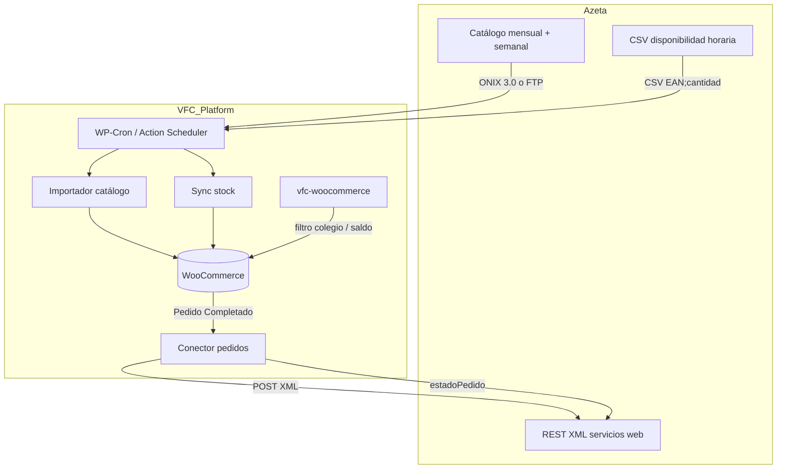
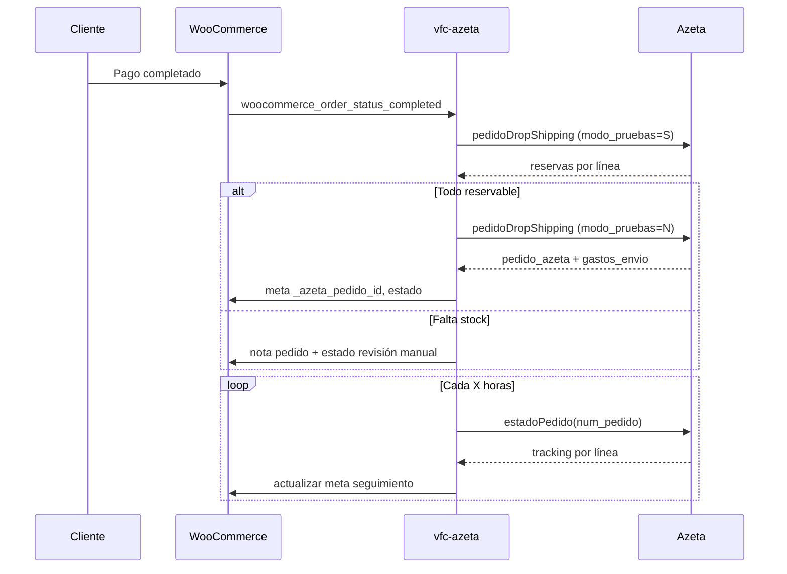

# Integración Azeta → WooCommerce (VFC)

Documento técnico unificado para el proyecto **Viaje fin de curso**. Resume la información de correos, ficheros de ejemplo y guías de servicios web de Azeta, y propone cómo encajarla en **WordPress + WooCommerce** y el plugin `vfc-woocommerce`.

**Estado:** borrador de diseño (junio 2026)  
**Fuentes:** ver carpeta `docs/proveedores/azeta/` (correos, PDFs, `feed_parcial.csv`)

---

## 1. Resumen ejecutivo

Azeta ofrece tres bloques de integración:

| Bloque | Coste | Uso en VFC |
|--------|-------|------------|
| **Catálogo** (libros + papelería) | Implantación + cuota mensual | Importar productos a WooCommerce; filtrar por colegio/centro |
| **Disponibilidad** (stock libros) | Incluido en catálogo | CSV horario → stock WooCommerce |
| **Servicios web** (pedidos, dropshipping, tracking) | Sin coste adicional | Enviar pedidos pagados; consultar estado |

**Modelo de negocio VFC relevante:** catálogo global con subconjunto por colegio, dropshipping al cliente final (familia/alumno), liquidaciones manuales al colegio. Azeta factura al minorista (plataforma); la plataforma factura al cliente final.

**Modalidad recomendada para VFC:** **dropshipping** (`pedidoDropShipping`), porque el envío va directo al cliente final con embalaje anónimo y datos comerciales de la plataforma.

---

## 2. Contrato y requisitos previos

Antes de desarrollar en producción:

1. Firmar **Acuerdo de prestación de servicio y acceso a la Base de datos** (duración inicial 1 año).
2. Obtener **usuario y contraseña** de servicios web (mismas credenciales que la web de Azeta para librerías).
3. Solicitar valor del campo **`origen`** (identificador del origen del pedido).
4. Confirmar canal de catálogo: **URL (ONIX 3.0)** o **FTP (Excel/CSV plano)**.
5. Revisar cláusulas: datos solo para nuestro cliente, **no ceder a terceros** (implica validar uso en tiendas por colegio).

**Pendiente de Azeta (jun 2026):**

- Confirmación explícita de bajas vía `Activo = N`.
- Fichero de ejemplo de **papelería** (una o varias subfamilias).

---

## 3. Arquitectura propuesta



**Principio:** plugin dedicado `vfc-azeta` (o módulo dentro de `vfc-woocommerce`) que no mezcle lógica de Azeta con reglas de negocio VFC (saldos, colegios, ediciones).

---

## 4. Catálogo de productos

### 4.1 Libros

**Entrega:**

| Canal | Formato | Frecuencia |
|-------|---------|------------|
| URL | **ONIX 3.0** (estándar completo) | Total mensual + actualizaciones semanales |
| FTP | Excel/CSV plano (ver `feed_parcial`) | Azeta sube a carpeta FTP del cliente |

El fichero incluye **todo el fondo** (con y sin stock). La selección temática o por colegio se hace **después** en VFC.

**Bajas de producto:** los registros **no se eliminan**. Campo `Activo`:
- `S` → producto vigente en el feed.
- `N` → deja de estar disponible; mantener en BD pero ocultar o marcar como discontinuado.

### 4.2 Papelería

**Subfamilias:** Escolar, Diseño, Regalo, Juegos y Juguetes, Informática.

- Misma estructura de campos en todas las subfamilias.
- Descarga por **URL** (no FTP según correo inicial).
- Coste por subfamilia o global: **pendiente de confirmar** con Azeta.

### 4.3 Mapeo feed FTP → WooCommerce

Basado en `ejemplos/feed_parcial.csv` (formato FTP). Clave única recomendada: **EAN** → SKU WooCommerce.

| Campo Azeta | Uso WooCommerce | Notas |
|-------------|-----------------|-------|
| `EAN` | `sku`, `_global_unique_id` | Identificador principal |
| `Titulo` | `name` | |
| `Autor` | atributo / meta `_azeta_autor` | |
| `Editorial` | atributo / meta `_azeta_editorial` | |
| `Coleccion` | atributo / meta | |
| `Resumen o Sinopsis` | `description` o `short_description` | |
| `Portada libro` | imagen externa (URL) | Descargar y adjuntar en importación |
| `PVP` | `regular_price` | Confirmar si incluye IVA |
| `IVA` | tipo impositivo WC | Mapear a clase de impuesto |
| `Descuento Cliente` | coste / margen interno | No exponer al cliente; usar para COGS |
| `Precio Cliente` | precio neto minorista | Referencia de coste |
| `Unidades Venta` | cantidad mínima / pack | Si >1, validar en carrito |
| `Libro Texto` | meta / categoría | `S`/`N` |
| `Permite Devolucion` | meta | |
| `Activo` | `catalog_visibility`, `status` | `N` → borrador o oculto |
| `Ibic`, `Thema` | categorías / tags | Clasificación temática |
| `Encuadernacion`, `Paginas`, `Peso (gr)`, dimensiones | atributos | |
| `Fecha Edicion`, `Fecha Servicio` | meta | |

**Importación ONIX 3.0:** requiere parser ONIX → estructura intermedia → `WC_Product`. Evaluar librería PHP ONIX o conversión previa a CSV. El feed FTP/Excel es más directo para un MVP.

### 4.4 Estrategia de sincronización catálogo

| Job | Frecuencia | Acción |
|-----|------------|--------|
| Importación total | Mensual | Crear/actualizar productos masivamente |
| Delta semanal | Semanal | Altas, cambios de precio/metadatos, `Activo` |
| Reconciliación | Tras cada import | Productos Azeta no presentes en delta con `Activo=N` |

Usar **Action Scheduler** (incluido en WooCommerce) en lugar de WP-Cron básico para colas largas.

---

## 5. Disponibilidad (stock)

**Fichero CSV** (descarga periódica, actualización **cada hora**):

```
EAN;cantidad
9788476002032;2
```

| Regla | Detalle |
|-------|---------|
| Separador | `;` |
| Límite por EAN | Máximo **50** en el fichero (aunque haya más en almacén) |
| Productos sin línea | Tratar como stock 0 o mantener último valor (definir política) |

**Alternativa en tiempo real:** servicio web `stock` (consulta por EAN vía XML POST). Útil para validar antes del checkout o del envío del pedido.

**Mapeo WooCommerce:**

```
stock_quantity = min(cantidad_csv, 50)
manage_stock   = true
stock_status   = cantidad > 0 ? 'instock' : 'outofstock'
backorders     = 'no'
```

**Job recomendado:** cada hora descargar CSV → actualizar solo SKUs existentes en catálogo VFC (filtrados por colegio si aplica).

---

## 6. Pedidos y dropshipping

### 6.1 Por qué dropshipping en VFC

- El cliente final (familia) recibe el paquete en su domicilio.
- Embalaje anónimo; etiqueta con **datos de la plataforma**.
- Azeta no contacta al cliente final; atención y reclamaciones vía VFC.
- Coste envío Azeta: **3,20 € + IVA** por envío (repercutible al cliente).
- **Hora de corte:** pedidos hasta **14:00** → preparación mismo día; entrega habitual **24–48 h**.

### 6.2 Flujo WooCommerce → Azeta



**Disparador:** solo pedidos en estado **`completed`** (alineado con MVP VFC: abono al saldo del alumno en el mismo momento).

### 6.3 Servicio `pedidoDropShipping`

| | |
|---|---|
| **XSD** | `http://www.azetadistribuciones.es/html/servicios_web/rest/pedidoDropShipping.xsd` |
| **Endpoint** | `POST http://www.azetadistribuciones.es/html/servicios_web/rest/index.php?service=pedidoDropShipping&format=xml` |
| **Body** | Campo POST `xml` con documento XML |

**Campos obligatorios del pedido:**

| Campo | Origen WooCommerce |
|-------|-------------------|
| `usuario`, `password` | Configuración plugin (cifradas) |
| `origen` | Configuración (solicitar a Azeta) |
| `cliente_nombre` | `shipping_first_name` + `shipping_last_name` |
| `cliente_direccion` | `shipping_address_1` + `shipping_address_2` |
| `cliente_codigo_postal` | `shipping_postcode` |
| `cliente_localidad` | `shipping_city` |
| `cliente_telefono` | `billing_phone` |
| `cliente_email` | `billing_email` (opcional pero recomendado) |
| `detalle_pedido/linea_pedido/ean` | SKU del producto (EAN-13) |
| `detalle_pedido/linea_pedido/cantidad` | Cantidad de línea |

**Campos de control:**

| Campo | Valor recomendado VFC | Descripción |
|-------|----------------------|-------------|
| `modo_pruebas` | `S` en staging; doble llamada en prod | `S` = simula sin registrar; `N` = pedido real |
| `reservar_completo` | `N` a nivel pedido | Si `S`, anula todo el pedido si falta una línea |
| `mensaje_regalo`, `para_regalo` | Opcional | Tarjeta regalo en el paquete |

**Comportamiento crítico:** en dropshipping, **línea no reservable = línea no registrada**. No hay pendientes (`pendientes` siempre 0). Solo entran en el pedido los artículos reservados.

**Flujo de doble llamada (recomendado por Azeta):**

1. `modo_pruebas=S` → revisar `reservados` por línea.
2. Si OK → `modo_pruebas=N` → confirmar.
3. Si el stock cambió entre llamadas → evaluar `borrarPedido` antes de que entre en preparación.

### 6.4 Servicio `borrarPedido`

| | |
|---|---|
| **XSD** | `http://www.azetadistribuciones.es/html/servicios_web/rest/borrarPedido.xsd` |
| **Endpoint** | `POST .../index.php?service=borrarPedido&format=xml` |
| **Campo clave** | `cod_pedido` = valor `pedido_azeta` de la respuesta |

Anulable solo **hasta que comienza la preparación** en almacén. Implementar botón admin “Anular en Azeta” con ventana temporal corta.

### 6.5 Servicio `pedido` (alternativa sin dropshipping)

Para pedidos al almacén del minorista (no es el caso habitual VFC). Diferencias respecto a dropshipping:

- Permite **`dejar_pendientes=S`** (líneas parcialmente reservadas).
- Requiere `forzar_envio` (S/N) por importe mínimo de pedido.
- XSD: `https://www.azetadistribuciones.es/html/servicios_web/rest/pedido.xsd`

Documentado por si en el futuro hubiera recogida centralizada; **no usar en MVP** salvo decisión de producto.

### 6.6 Servicio `estadoPedido` (tracking)

| | |
|---|---|
| **XSD** | `http://www.azetadistribuciones.es/servicios_web/rest/estadoPedido.xsd` |
| **Endpoint** | `POST https://www.azetadistribuciones.es/html/servicios_web/rest/index.php?service=estadoPedido&format=xml` |
| **Entrada** | `num_pedido` = `pedido_azeta` |

**Estados por línea (`codigo_estado`):**

| Código | Estado | Acción VFC |
|--------|--------|------------|
| 0 | Pendiente | Mantener pedido en procesamiento |
| 1 | Reservado | — |
| 2 | Preparándose | — |
| 3 | Enviado | Guardar `codigo_seguimiento`, `url_seguimiento`, `transportista`; notificar cliente |
| 4 | Devuelto | Alerta admin |
| 5 | Incidencia | Alerta admin + nota en pedido |

Campos útiles en envío: `fecha_transporte`, `num_albaran`, `url_seguimiento`.

### 6.7 Servicio `stock` (consulta puntual)

| | |
|---|---|
| **XSD** | `https://www.azetadistribuciones.es/html/servicios_web/rest/stock.xsd` |
| **Endpoint** | `POST https://www.azetadistribuciones.es/html/servicios_web/rest/index.php?service=stock&format=xml` |

Permite consultar varios EAN en una llamada. Usar en checkout para productos de alto volumen o cuando el CSV horario no baste.

---

## 7. Códigos de error (referencia rápida)

### Pedido dropshipping (nivel pedido)

| Código | Significado |
|--------|-------------|
| -1 | XML mal formado |
| -2 | Validación XSD |
| -3 | Usuario no identificado |
| -4 | Error interno |
| -5 | CP sin servicio de envío |
| -6 | `reservar_completo=S` y no se pudo reservar todo |
| -7 | Ninguna línea reservada |
| -8 | Modo pruebas activo (no registra) |

### Línea de pedido

| Código | Significado | Acción |
|--------|-------------|--------|
| -1 | Artículo no encontrado | Revisar EAN / catálogo desactualizado |
| -2 | Antigua edición | Usar `ean_nueva_edicion` si viene informado |

---

## 8. Diseño del plugin / módulo

### 8.1 Estructura sugerida

```
wp-content/plugins/vfc-azeta/
├── vfc-azeta.php
├── includes/
│   ├── class-catalog-importer.php    # ONIX + CSV/Excel
│   ├── class-stock-sync.php          # CSV horario + WS stock
│   ├── class-order-dropship.php      # pedidoDropShipping
│   ├── class-order-tracker.php       # estadoPedido
│   ├── class-azeta-api-client.php    # HTTP POST XML común
│   └── class-admin-settings.php      # credenciales, origen, modo pruebas
└── docs/ → enlace simbólico o referencia a repo docs/
```

### 8.2 Metadatos en pedido WooCommerce

| Meta key | Contenido |
|----------|-----------|
| `_azeta_pedido_id` | `pedido_azeta` |
| `_azeta_gastos_envio` | Gastos devueltos por Azeta |
| `_azeta_modo` | `dropshipping` |
| `_azeta_last_sync` | Timestamp última consulta estado |
| `_azeta_tracking_url` | URL seguimiento transportista |

### 8.3 Metadatos en producto

| Meta key | Contenido |
|----------|-----------|
| `_azeta_ean` | EAN-13 |
| `_azeta_activo` | S/N del feed |
| `_azeta_editorial` | Editorial |
| `_azeta_last_catalog_sync` | Timestamp |

### 8.4 Integración con `vfc-woocommerce`

- El conector Azeta **no debe** calcular saldos ni filtrar por colegio; solo sincroniza catálogo/stock y envía pedidos.
- El filtro de catálogo por colegio sigue en `vfc-woocommerce` (productos permitidos por centro).
- Hook principal: `woocommerce_order_status_completed` → cola Action Scheduler → envío a Azeta.
- En staging: `modo_pruebas=S` siempre; flag en `wp-config.php` o ajuste del plugin.

### 8.5 Seguridad

- Credenciales en `wp_options` cifradas o variables de entorno (`.env` fuera del repo).
- No loguear XML con contraseñas.
- Validar CP español antes de llamar al WS (error -5).

---

## 9. Plan de implementación por fases

### Fase A — Catálogo (MVP)

1. Importador CSV/Excel desde FTP (formato `feed_parcial`).
2. Parser ONIX 3.0 (si se elige canal URL).
3. Mapeo a productos WooCommerce + descarga de portadas.
4. Gestión `Activo=S/N`.

### Fase B — Stock

1. Job horario: descarga CSV disponibilidad.
2. Actualización masiva de stock por SKU/EAN.
3. (Opcional) Consulta `stock` WS en add-to-cart para productos críticos.

### Fase C — Pedidos

1. Cliente API XML (POST `xml=...`).
2. Doble llamada dropshipping en entorno de pruebas Azeta.
3. Meta `pedido_azeta` en pedidos WC.
4. Pantalla admin: estado Azeta + botón anular.

### Fase D — Tracking

1. Job periódico `estadoPedido` para pedidos abiertos.
2. Email al cliente con `url_seguimiento` cuando `codigo_estado=3`.
3. Panel en portal tutor/alumno (si aplica en roadmap).

---

## 10. Riesgos y decisiones abiertas

| Tema | Riesgo | Mitigación |
|------|--------|------------|
| PVP con/sin IVA no confirmado | Precios incorrectos en tienda | Pregunta cerrada a Azeta antes de Fase A |
| Límite stock 50 en CSV | Cliente ve stock bajo | Aceptar como diseño Azeta; aviso en UI si cantidad > stock |
| Dropshipping sin pendientes | Líneas caen silenciosamente | Doble llamada + revisión admin si `reservados < pedidos` |
| ONIX vs Excel | Esfuerzo parser ONIX alto | MVP con FTP/Excel; ONIX en fase 2 si canal URL |
| Papelería sin muestra | No estimar integración | Bloquear Fase papelería hasta recibir ejemplo |
| Contrato: no ceder a terceros | Tiendas por colegio | Validar redacción contractual con Azeta |
| URLs de WS inconsistentes | Algunos PDF usan rutas distintas | Usar siempre `.../html/servicios_web/rest/...` salvo XSD de estadoPedido |

---

## 11. Referencias internas

| Documento | Ruta |
|-----------|------|
| Correo inicial integración | `correos/mail-integracion-azeta-2026-06-03.md` |
| Hilo Q&A junio 2026 | `correos/hilo-integracion-bd-azeta.md` |
| Borrador preguntas enviadas | `correos/borrador-respuesta-azeta-catalogo.md` |
| Ejemplo catálogo FTP | `ejemplos/feed_parcial.csv` |
| Guía dropshipping | `documentacion-tecnica/Servicios_web_Dropshipping__Azeta_Guia_programador.pdf` |
| Guía pedidos + stock | `documentacion-tecnica/Servicios_web_pedidos_Azeta.pdf` |
| Guía estado pedido | `documentacion-tecnica/WS_estado_Pedido.pdf` |
| Plan MVP VFC | `../../planificacion/PLAN-MVP.md` |

---

## 12. Contacto Azeta

- **Mónica García Valverde** — monicagarcia@azetadistribuciones.es  
- **Jorge Vargas Delgado** — jvargas@azetadistribuciones.es  
- Tel.: 627 302 443 / 916 866 892  
- Web: https://www.azeta.es
